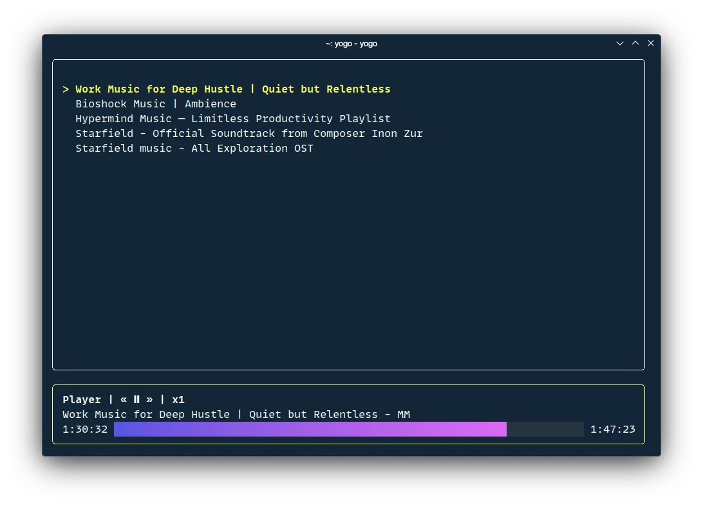

A terminal-based YouTube music player built with Go. Search, play, and manage your favorite YouTube music videos right from your terminal.



## Features

- **Search**: Find songs directly from your terminal
- **Play Music**: Stream YouTube videos as audio
- **History**: Keep track of recently played songs
- **Controls**: Play/pause, seek, and speed controls
- **Resume Playback**: Continue from where you left off
- **Beautiful UI**: Terminal interface built with [Bubble Tea](https://github.com/charmbracelet/bubbletea)
- **Configurable**: Customize behavior with a config file

## Installation

### Prerequisites

Before installing Yogo, you need to have these tools installed:

1. **yt-dlp** - For extracting audio streams from YouTube
   ```bash
   # On Arch Linux
   brew install yt-dlp

   # On Ubuntu/Debian
   sudo apt install yt-dlp
   ```

2. **mpv** - Media player for audio playback
   ```bash
   # On Arch Linux
   sudo pacman -S mpv

   # On Ubuntu/Debian
   sudo apt install mpv
   ```

### Install Yogo

#### Option 1: Download Pre-built Binary

Check the [releases page](https://github.com/gabrielcapilla/yogo/releases) for the latest binary.

#### Option 2: Build from Source

```bash
# Clone the repository
git clone https://github.com/gabrielcapilla/yogo.git
cd yogo

# Build the binary
go build -o yogo ./cmd/yogo

# (Optional) Move to a directory in your PATH
sudo mv yogo /usr/local/bin/
```

## Usage

Simply run the `yogo` command to start the application:

```bash
yogo
```

### Controls

Once in the application:

- **Search View**:
  - `s` to access search view and focus on search bar
  - `tab` to switch between search bar and list selection
  - Press `enter` to play a song from the search results
  - Press `esc` to focus on the player.

- **History View**:
  - `h` to access history view and focus on history bar
  - `tab` to switch between search bar and list selection
  - Press `enter` to play a song from history
  - Press `esc` to focus on the player.

- **Player Controls** (when a song is playing):
  - `space` - Play/Pause
  - `←`/`→` - Seek backward/forward 5 seconds
  - `[`/`]` - Decrease/increase playback speed
  - `` \ `` - Reset playback speed to normal
  - `q` - Quit application

> *Yes, the controls need to be reconsidered.*

## Configuration

Yogo creates a configuration file at:

- **Linux**: `~/.config/yogo/config.yml`

The default configuration is:

```yaml
# Path to cookies.txt file for YouTube authentication (optional)
cookiesPath: ""

# Number of entries to show in history
historyLimit: 16

# Number of search results to show
searchLimit: 16

# Playback settings
playback:
  # Loop the current track
  loop: true

  # Save playback position when quitting
  savePositionOnQuit: true
```

### Using Cookies for YouTube

If you want to access age-restricted or region-blocked content, you can provide YouTube cookies:

1. Export your YouTube cookies to a file (using browser extensions like "Get cookies.txt")
2. Update the `cookiesPath` in your config file to point to the cookies file

## Acknowledgments

- [Bubble Tea](https://github.com/charmbracelet/bubbletea) for the amazing TUI framework
- [yt-dlp](https://github.com/yt-dlp/yt-dlp) for YouTube video extraction
- [mpv](https://mpv.io/) for the media player
- [bbolt](https://github.com/etcd-io/bbolt) for the embedded key/value database
